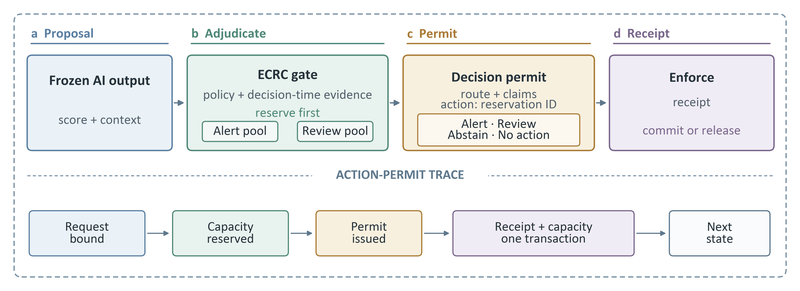

# ECRC: Transactional AI Decision Permits

ECRC is an open-source reference implementation of an **Evidence, Capacity,
Route and Claim** control layer for sequential AI decision support. It sits
between a frozen predictive component and an operational side effect.



## Problem

A model score can propose an action, but it does not establish that the
decision-time evidence is eligible, that a finite alert or review resource is
available, that the permitted interpretation is appropriately bounded, or
that reserved capacity is reconciled after execution. These gaps become
stateful in sequential systems: otherwise similar predictions can require
different routes as evidence and resource state change.

## Framework

ECRC turns each proposal into one machine-checkable lifecycle:

1. validate policy, model identity and decision-time evidence eligibility;
2. adjudicate exactly one route: `alert`, `human_review`, `abstain`, or
   `no_action`;
3. atomically reserve the selected alert or review pool before issuing an
   action permit;
4. bind the permit to its route, evidence, reservation and finite claim set;
5. accept only a registered, content-matching, unconsumed permit; and
6. write a matching receipt while committing the reservation after simulated
   execution or releasing it on the declared pre-execution-failure path.

The contribution is not abstention, evidence rules, quotas or receipts in
isolation. It is the evaluated relation among a **route-specific reservation,
bounded decision permit and receipt-reconciled state** at one control point.

## Evaluation snapshot

| Question | Evidence in this repository | Main result |
|---|---|---|
| Do model ranking and frozen operating points transfer? | Three proposal generators; 66,525 development decisions from 617 participants; 11,800 external same-task decisions from 59 participants | External AUROC remained ordered history < logistic < HGB; two of three frozen threshold-and-capacity operating points missed the development precision condition |
| Do routing components affect distinct properties? | 2,349,750 matched route assignments: 234,975 model-decisions across five routing arms and two evidence scenarios | Bypassing evidence admission allowed action routes on constructed invalid evidence; changing capacity altered coverage and workload without changing predictions |
| Does the executable stack match the vectorised router? | Independent adjudicator-ledger-PEP-receipt replay | 11,800/11,800 external HGB routes and reasons matched |
| Does transactional reservation preserve declared capacity? | Single-node SQLite WAL contention tests | Capacity stopped at 3/3 and 8/8 with no oversubscription; a constructed non-atomic witness admitted 2/1 |
| Are declared permit/receipt faults detected? | Trusted-stack conformance fixtures | 84/84 injected cases flagged; 0/32 clean controls flagged |

Confidence intervals, denominators and estimand boundaries are preserved in
the aggregate evidence and figure source tables. See
`docs/CLAIM_TO_ARTIFACT.md` for the exact claim-to-file map.

## Quick start

Python 3.12 is the tested environment.

Windows PowerShell:

```powershell
python -m venv .venv
.\.venv\Scripts\python.exe -m pip install -e ".[test,figures]"
.\.venv\Scripts\python.exe -m pytest -q
.\.venv\Scripts\python.exe scripts\verify_release.py
```

Linux/macOS:

```bash
python3 -m venv .venv
.venv/bin/python -m pip install -e ".[test,figures]"
.venv/bin/python -m pytest -q
.venv/bin/python scripts/verify_release.py
```

The focused suite currently contains 31 tests spanning policy/evidence
validation, claim binding, route invariants, idempotency, permit replay,
capacity concurrency, systems determinism, causal history features and data
download guards.

## Repository layout

```text
src/agentic_eeg_dm/governance/         ECRC permit, ledger, PEP and verifier
icair_2026/framework_v1/e1/            causal features, models and routing
icair_2026/framework_v1/*.py           experiments and systems benchmarks
icair_2026/framework_v1/evidence*/     aggregate evidence and manifests
manuscript/.../figures/                figure code, source data and QA
scripts/                               data acquisition and release checks
tests/                                 focused governance and replay tests
docs/                                  data, reproduction and claim map
```

## Reproduction tiers

### Tier 1: governance core and deterministic fixtures

```bash
python -m pytest -q
```

These tests cover evidence and claim binding, route invariants, idempotency,
permit replay, stale/expired/revoked policies, transactional capacity and
concurrent reservations.

### Tier 2: single-node systems benchmark

```bash
python icair_2026/framework_v1/run_systems_benchmark.py   --output-dir scratch/systems --run-id anonymous_repeat
python icair_2026/framework_v1/verify_systems_determinism.py   icair_2026/framework_v1/evidence_systems/systems_benchmark_structure.json   scratch/systems/systems_benchmark_structure.json   --output scratch/systems/determinism_check.json
```

Latency is host-specific.  The timing-free structure and capacity invariants
are the deterministic comparison targets.

### Tier 3: figures from frozen aggregate evidence

```bash
python manuscript/icair_2026/framework_v1/figures/make_framework_figures.py
python manuscript/icair_2026/framework_v1/figures/make_fig3_layered_evaluation.py
python manuscript/icair_2026/framework_v1/figures/make_fig2_capacity_tradeoff.py
python manuscript/icair_2026/framework_v1/figures/make_fig4_prediction_permission.py
```

The scripts include point/interval checks and publication-export QA.  See each
figure's manifest and QA report in the same directory. The manuscript mapping
is Figure 2 → `make_fig3_layered_evaluation.py` and Figure 3 →
`make_fig2_capacity_tradeoff.py`. Exact typography-matched rendering requires
Calibri; the committed images, source data and checksums remain inspectable on
hosts without that font.

### Tier 4: full model replay

The full E1 and runtime-bridge scripts are included, but their row-level inputs
and fitted model files are intentionally not redistributed in this aggregate
artifact. Download the public upstream data and follow
`docs/REPRODUCIBILITY.md` to regenerate them.  This boundary matches the paper's
promise of code, tests, manifests, hashes and aggregate evidence artifacts.

## Evidence map

See `docs/CLAIM_TO_ARTIFACT.md`.  Aggregate results are under
`icair_2026/framework_v1/evidence_v2`, `evidence_systems`, `evidence_bridge`,
and `evidence`.

## Licence and data boundary

Code is MIT licensed.  Aggregate evidence and generated figures are distributed
under CC BY-SA 4.0 with upstream attribution; see `LICENSES.md` and
`docs/DATA_ACCESS.md`.  No raw upstream dataset is included.

## Scope

This repository demonstrates retrospective routing, single-node transactional
capacity and simulated side effects. It does not establish prospective user
benefit, clinical validity, institutional or legal authorization, distributed
atomicity, external-service delivery, adversarial security or unknown-fault
coverage.

Author-facing citation metadata is intentionally withheld during double-blind
review and will be restored in the archival release.
