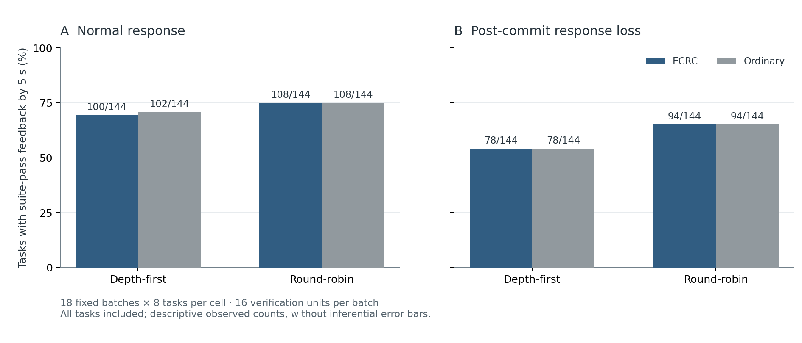

# S9: bounded verification of published generated programs

The complete exploratory application study executed 144 predeclared trajectories with no technical failures. It shows that both the ECRC client and the matched ordinary client can govern real, feedback-dependent verification work under the same cumulative count budget. It does not show an ECRC accuracy advantage. The independent audits agree with every published job, run, aggregate and paired-batch CSV row.

## Workload and measurement

An action runs one published sanitized Llama-3.1-8B program against the original official HumanEval suite in a fresh isolated child. Each task has four candidates selected by the fixed hash rule, retaining empty and duplicate records. Eighteen evaluation batches contain eight tasks each: 144 distinct evaluation tasks, reused across two candidate-selection policies, two clients and two response conditions. All 164 source tasks, including the 20-task engineering development partition, were previously exposed in local work. This is not a fresh holdout, a new model-generation study or a confirmatory estimate.

Each trajectory has 16 permanent verification units for 32 candidate opportunities and a five-second timely-feedback window. A unit is consumed by an issued verification permit; outcome uncertainty does not create another reusable slot. The deadline was fixed from all 80 serial development-job timings. Primary completion counts distinct eligible tasks whose official-suite-pass feedback is checked and reconciled by five seconds. Its denominator is all eight tasks, including tasks not attempted or never passed. A suite pass means acceptance by these finite tests under the recorded environment, not general program correctness.

Depth-first and round-robin both preserve candidate rank, stop a task only after reconciled pass feedback, and follow their own executed trajectories. The controlled response-loss condition suppresses the first response after durable result commit on every fourth newly armed job. Both clients then use the same one-second delay before retrying for the cached result. No service crash before result commit is injected.

## Observed results

Every table entry below is timely accepted tasks out of the same 144 eligible tasks (18 batches × eight tasks). These are descriptive counts on one host; the repeated conditions do not create additional independent tasks.

| Response condition | Candidate policy | ECRC | Ordinary |
|---|---|---:|---:|
| Normal | Depth-first | 100/144 (69.44%) | 102/144 (70.83%) |
| Normal | Round-robin | 108/144 (75.00%) | 108/144 (75.00%) |
| Post-commit response loss | Depth-first | 78/144 (54.17%) | 78/144 (54.17%) |
| Post-commit response loss | Round-robin | 94/144 (65.28%) | 94/144 (65.28%) |

Round-robin reached more timely accepted tasks in these observed trajectories under both clients. The client totals tied in three of the four condition/policy comparisons. The two-task depth-first normal-response difference occurred entirely in the first paired batch. Its first ECRC launcher took 1.875 seconds; the matching first ordinary launcher took about 0.203 seconds. This is consistent with sensitivity to startup and ordering, and does not isolate an implementation-level causal effect or establish runtime superiority. No warm-up, alternative deadline, significance test or inferential confidence interval was selected after seeing evaluation outcomes.

The [PDF figure](analysis/figures/S9_application_results.pdf), four [analysis CSV files](analysis/), and plotting source accompany these counts. The paired-batch table preserves all 18 matched batches for each contrast.

## Recorded work, delivery and budget

Across the 144 trajectories, there were 1,802 independently recorded suite starts: 780 pass, 1,014 fail and eight timeout outcomes. The 1,996 HTTP posts included 194 cached retries after 194 injected post-commit response drops. There were 140 retries in the primary phase and 54 in the cleanup phase. Every cached retry in this experiment returned the already committed result without another suite start. This observation does not extend to service failure before the computation's durable result commit.

The observed work totaled 37.471644 child CPU seconds, 40.690515 supervised-suite wall seconds and 412.879000 launcher wall seconds. These are sums of separate observations, not interchangeable measures or an enforced aggregate CPU budget. Launcher timing includes WSL/namespace startup and result collection. Per-job launcher wall time had median 0.203 seconds and maximum 3.219 seconds. The complete serial formal grid took about 701.963 seconds, including workflow and recovery overhead. Input/client setup and service readiness precede each trajectory's five-second clock.

Summing the repeated task-condition observations gives 762 timely accepted tasks, 774 with a durable pass observed by the deadline, and 780 eventually reconciled accepted tasks. The denominator of 1,152 is 144 tasks observed under eight matched configurations; it is not 1,152 distinct benchmark tasks. No observed trajectory exceeded 16 held-plus-committed units. The maximum observed held count at a stop checkpoint was one, and all final held counts were zero. The 31 non-action decisions and all unsuccessful candidate outcomes remain in the records. No host launch was observed after five seconds in this run, but the protocol allows a previously initiated issuance or arm to cross the boundary; this study does not establish a hard physical start/stop guarantee at D.

## Interpretation and boundaries

The one-in-flight workflow serially waits for recovery before choosing more work. That global wait is a declared scheduler choice shared by both clients, not a requirement imposed by the ECRC contract. A scheduler could keep an uncertain unit held while progressing independent authorized work. Consequently, the response-loss result is evidence about this controlled serial recovery policy, deadline and injected fault pattern; it is not an inherent ECRC throughput penalty or a universal cost of permit recovery. A held unknown unit and a committed unit each consume one permanent cumulative unit.

The application contributes actual generated-program execution, independently sourced official tests, content-bound permits/results, measured costs and output-dependent next choices. It does not establish production benefit, monetary savings, general code correctness, fresh-model performance, exactly-once CPU execution through pre-commit crashes, or resistance to deliberately harness-aware malicious Python. The official suites have finite coverage. The namespace and trusted supervisor separate execution/start/cost records from candidate output, but the functional evaluator is not presented as a proof against malicious test-harness manipulation. Only one installed Windows/WSL environment and one trajectory per cell were used.

## Independent checks and public reproduction

The selected [independent audit summaries](audits/INDEPENDENT_AUDITS.json) report: 73,214 raw-adapter checks, 38,086 normalized-core checks, 42,568 contract checks, and 52,699 cross-analysis comparisons. These counts refer to different, partly overlapping checks, not independent statistical observations. The CSV comparison covered all 1,802 job rows, 144 run rows, eight aggregate rows and 216 paired-batch rows. The contract audit found no inconsistent finite-suite outcome among the 266 distinct selected candidates actually observed across the matched clients. Audits read saved evidence; they did not rerun candidates.

`check_public.py --public-only` independently recomputes the published trajectories from the public input, client/service event, result and trusted-start structures. It checks the 32-candidate input opportunities, request/job/permit/effect bindings, feedback-driven choices, timely acceptance, physical start counts, drop/cache counts and event-prefix budgets before cross-checking summaries and analysis rows. The public package also includes the eight successful development trajectories and a neutral summary/history of all eight earlier development failures.

Candidate-program redistribution permission remains unspecified. Candidate bodies, input payloads containing programs, raw databases and source-bearing logs are excluded. The [README](README.md) provides the authors' precise public download/member recipe, official MIT tests/license, selection indices and hashes, and reconstruction commands. Full catalog reconstruction must match SHA256 `bbd28484d9f10143b1d5db9d80740996b49a43987e5f737ce659114a3b87a9c8`; the runner bundle must match `e05cebc18c2dab444215fb826377edb0480db72e2bf33ed776afbbc2a1d7f150`.

The selected raw/core/contract reports summarize checks against author-held original bytes. Public projections retain their own file hashes and original-file SHA references, but are not a byte-complete raw-evidence release. Removing candidate text and local paths prevents recomputing a complete original `result_hash` from a projection. That check requires the original author archive. Public recalculation, source reconstruction and the private original-byte audit are distinct checks.
